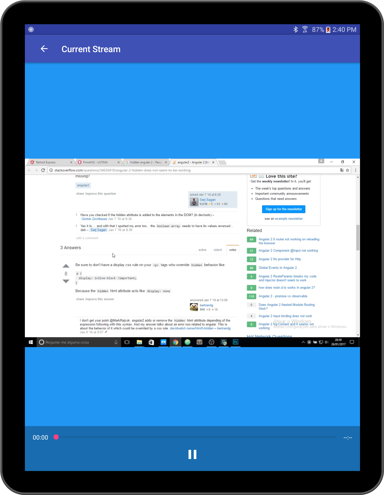

# Livecoding

Libraries used:
# EventBus
# FireBase Ads
# Firebase Analytics
# CardView
# DevBrackets ExoMedia
# BumpTech Glide
# Google Gson
# Retrofit 2 
# OkHttp
# Simonvt Schematic

The app authenticates against an OAUTH 2 server and recieves an access token. access token is used to display a gridview page of thumbnails which when tapped opens a streams player. app also implements a widget. 
